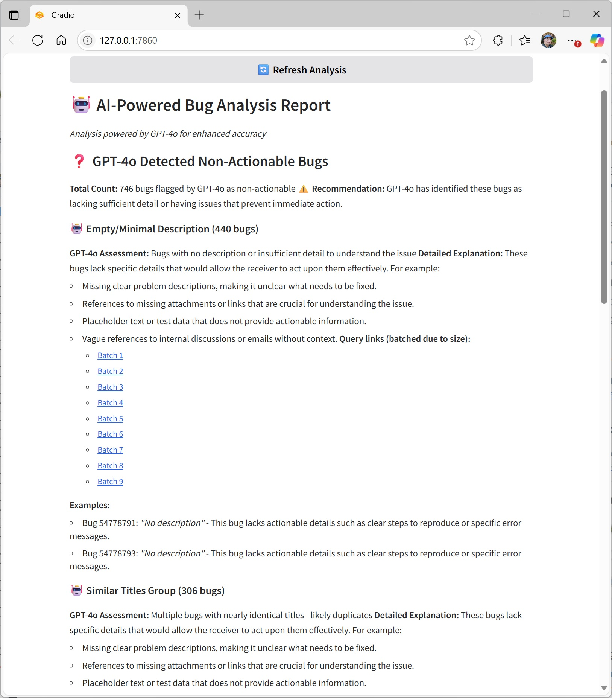

# Bugger

A Gradio-based dashboard for analyzing and categorizing Azure DevOps bugs, helping you prioritize and clean up your bug backlog.

## Features

- **🤖 AI-Powered Analysis**: Optional GPT-4o integration for intelligent bug categorization and actionability assessment
- **Smart Fallback System**: Graceful degradation to heuristic analysis when OpenAI package is unavailable
- **Questionable Bug Detection**: Identifies bugs with insufficient descriptions, broken references, or other issues that make them non-actionable
- **Intelligent Categorization**: AI-enhanced grouping of actionable bugs by type (crashes, performance, drivers, etc.)
- **Azure DevOps Integration**: Direct query links to view bugs in Azure DevOps
- **Statistical Analysis**: Shows average bug age and time in active state
- **Batch Query Support**: Handles large bug lists by creating batched queries
- **Dual Mode Interface**: Dynamic UI showing current analysis mode (AI vs heuristic)

## Setup

1. Create a `.env` file with your Azure DevOps credentials:
```
AZURE_DEVOPS_ORG=your-organization
AZURE_DEVOPS_PROJECT=your-project
AZURE_DEVOPS_USER_EMAIL=your-email@domain.com
AZURE_DEVOPS_PAT=your-personal-access-token

# Optional: Enable AI-powered analysis (requires OpenAI package)
OPENAI_API_KEY=your_openai_api_key_here
```

### How to get your Personal Access Token (PAT):
1. Go to https://dev.azure.com and sign in
2. Click on your profile picture (top right) → User settings → Personal access tokens
3. Click "New Token"
4. Give it a name and select expiration
5. Under "Scopes", select:
   - Work Items → Read
   - Project and Team → Read
6. Click "Create" and copy the token immediately (you won't see it again!)

2. Install dependencies:
```cmd
pip install -r requirements.txt
```

### Optional: Enable AI-Powered Analysis
For enhanced AI-powered bug analysis using GPT-4o:
```cmd
pip install openai
```
Then add your OpenAI API key to the `.env` file. The application will automatically detect the availability of AI features and fall back to heuristic analysis if OpenAI is unavailable.

3. Run the dashboard:
```cmd
python main.py
```

## Architecture

The application is organized into modular components:

- `config.py` - Configuration and environment variables with optional AI detection
- `azure_client.py` - Azure DevOps API interactions
- `bug_analyzer.py` - Bug statistics calculations
- `bug_categorizer.py` - Actionable bug categorization
- `report_generator.py` - Report generation logic
- `questionable_analyzer.py` - Heuristic-based questionable bug detection
- `ai_bug_analyzer.py` - GPT-4o powered intelligent bug analysis (optional)
- `main.py` - Main orchestration and adaptive Gradio UI

